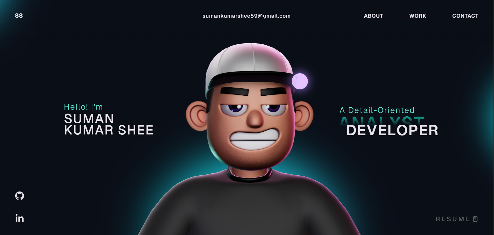

# 🚀 Suman Shee - Developer Portfolio  


🌐 **Live Website:** https://suman-shee.vercel.app/

---

## 📌 About The Project

Welcome to my personal portfolio website!  
This project showcases my skills, projects, and creativity using modern web technologies and interactive 3D experiences.

✨ Highlights:
- 💻 Developer skills showcase  
- 📂 Projects & work experience  
- 🌌 Interactive 3D UI  
- 🎯 Smooth animations  

---

## 🚀 Live Preview

🌐 https://suman-shee.vercel.app/  
> Experience the portfolio live with 3D interactions and animations

---

## ⚙️ Tech Stack

- ⚛️ React (Vite)  
- 🟦 TypeScript  
- 🎮 Three.js / React Three Fiber / Drei  
- 🎞️ GSAP (Animations)  
- 🎨 CSS3  
- 💾 Vercel (Deployment)  

---

## ✨ Features

- 🌌 Interactive 3D elements  
- 🎯 Smooth GSAP animations  
- ⚡ Fast performance with Vite  
- 📱 Fully responsive design  
- 🎨 Clean and modern UI  
- 🔥 Optimized for deployment  

---

## 📸 Preview



---

## 🛠️ Installation & Setup

Run this project locally:

```bash
# Clone the repository
git clone https://github.com/sumanshee39190/portfolio.git

# Navigate into the folder
cd portfolio

# Install dependencies
npm install

# Start development server
npm run dev
```
🏗️ Build for Production
npm run build

🚀 Deployment

This project is deployed using Vercel
You can deploy your own version easily by connecting your GitHub repository to Vercel.

## 👨‍💻 Connect With Me

[](https://suman-shee.vercel.app/)
[](https://www.linkedin.com/in/sumankumarshee/)
[](https://github.com/sumanshee39190)

⭐ Support

If you like this project:

⭐ Star this repository

🍴 Fork it

📢 Share it

💡 Future Improvements

🌗 Dark/Light mode toggle

🧠 Blog section

🚀 Performance optimization

🎮 More 3D interactions

📄 License

This project is licensed under the MIT License.

## 🌟 Credits

Designed & developed with ❤️ by **Suman Shee**

🌐 https://suman-shee.vercel.app/  
🔗 https://www.linkedin.com/in/sumankumarshee/  
🐙 https://github.com/sumanshee39190  

If you like this project, don’t forget to ⭐ the repository!
